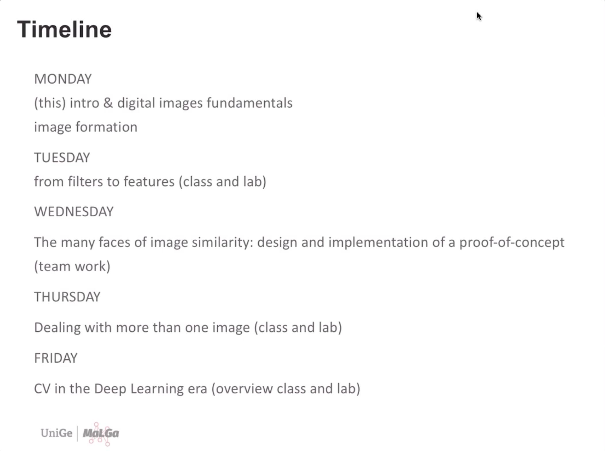

# CVCC2021Repo
My Repo for [CVCC2021](https://ml.unige.it/education/school/cvcc2021/#references): Computer Vision Crash Course July 5 - July9 2021 by MalGa

Course Instructor: [Francesca Odone](https://scholar.google.com/citations?user=riK7DscAAAAJ&hl=en)

## Practical Introduction to CV

## Desciption
|./day_x - Files from each days  
|./img - Pretty obvious  
|./git_pus.sh - Be lazy like me. Let bash push for you!  